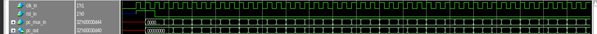

# RISC-V RTL DESIGN
## Introduction
RISC-V is an open-source instruction set architecture designed for computer processors, known for its simplicity and efficiency. It offers design freedom and customization options, making it adaptable to a wide range of applications. Since its introduction in 2010, RISC-V has 
gained significant traction and is being embraced by various industries. Its open nature and vibrant ecosystem have fostered innovation and democratized processor development. RISC-V processors are used in diverse devices, from IoT devices to high-performance computing systems. In this project, we have designed a 3 stage pipelining using verilog codes in MODELSIM software.
 
## Output Waveforms 

   
  Top Module

 

   
  PC MUX

 

   
  Reg Block 1

 

   
  Immediate Generator

 

   
  Immediate Adder

 

   
  Integer File

 

   
  Wire Enable Generator

 

   
  Instruction MUX

 

   
  Branch Unit

 

   
  Decoder

 

   
  Decoder

 

   
  Machine Control

 

   
  Machine Control

 

   
  Machine Control

 

   
  CSR File

 

   
  CSR File

 

   
  CSR File

 

   
  Reg Block 2

 

   
  Reg Block 2

 

   
  Store Unit

 

   
  Load Unit

 

   
  ALU

 

   
  WB MUX Selection Unit

 
